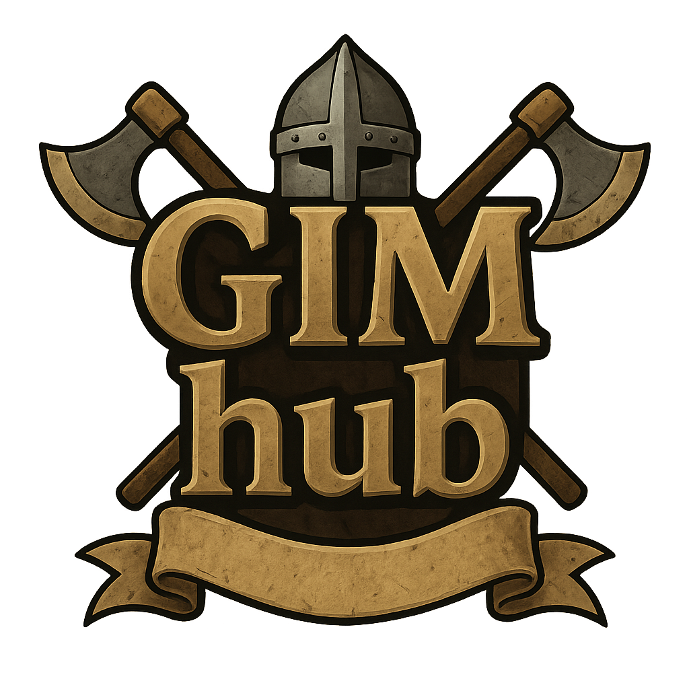

# GIM hub

GIM hub is a hosted dashboard for Old School RuneScape Group Ironman teams. It connects to a RuneLite plugin to stream live data from your teammates and turns it into a rich, shared view of your group's progress.

What it offers
- Live group overview: online status, world, current interaction, and health bars
- Inventories, equipment, and rune pouch details with HA and GE value estimates
- Skills overview with total level, total XP, and levels
- Quest progress
- Achievement Diary tracker
- Collection log browser
- Live world map with player markers
- XP drops feed for recent gains

How it works
- Each member installs the “GIM hub” RuneLite plugin from the Plugin Hub
- In the plugin's config, set your Group Name and Group Token from this app
- The plugin sends updates to the GIM hub server; the UI renders it in real time
