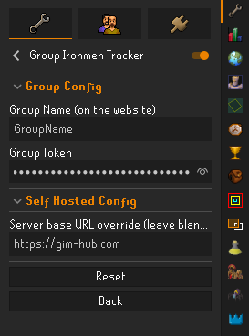

# 🏆 GIM Hub

  
  
  **A real-time dashboard for Old School RuneScape Group Ironman teams**
  
  Track your team's progress and view member locations with live data streaming from RuneLite.

## ✨ Features

### 📊 **Live team overview**

- Real-time online status and world tracking
- Current player interactions and activities
- Live health, prayer, and run energy bars
- Team member locations on interactive world map

### 🎒 **Inventory & equipment tracking**

- Complete inventory and equipment views
- Rune pouch contents with quantities
- High alchemy and Grand Exchange values

### 📈 **Skills & progress**

- Individual skill levels and experience tracking
- Total level and experience summaries
- Live XP drops feed for current gains
- Progress comparison between team members

### 🗺️ **Quest & achievement progress**

- Quest completion tracking
- Achievement diary progress monitoring
- Collection log browser with item counts

## 🚀 Getting started

### Prerequisites

- Old School RuneScape GIM account
- RuneLite client installed
- Group Ironman team setup

### Setup instructions

1. **Install the RuneLite plugin**
   - Open RuneLite
   - Go to the plugin hub
   - Search for "GIM Hub" and install

2. **Configure your team**
   - Create your group on the GIM Hub website
   - Copy your unique group token
   - In RuneLite, open the GIM Hub plugin settings
   - Enter your group name and group token

3. **Start tracking**
   - The plugin automatically streams your data
   - View your team's progress on the GIM hub dashboard
   - Invite teammates using your group token

<em>Plugin configuration in RuneLite</em>
