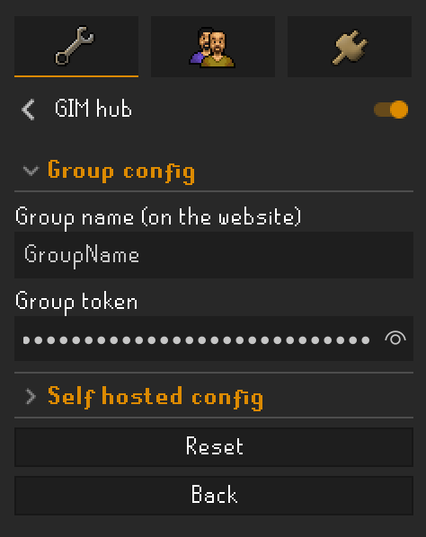

# GIM Hub

GIM Hub is a live dashboard for Old School RuneScape Group Ironman teams. The RuneLite plugin sends member activity and progress to the website, where the group can view it together.

[Website](https://gim-hub.com) · [Discord](https://discord.gg/ZwzW6yYD8V)

## Features

- **Live group overview:** See who is online, their worlds, current activities and interactions, health, prayer, and run energy.
- **World map:** Follow member locations on an interactive map.
- **Items:** Browse and search items across group members, with quantities by member and storage location, plus Grand Exchange and high alchemy values.
- **Storage:** View bank, shared bank, inventory, equipment, quiver, rune pouch, seed vault, potion storage, POH costume room, spice rack, pet house, servant's moneybag, STASH units, and items held by the tool leprechaun and Elnock Inquisitor.
- **Portable containers:** Track plank sacks, master scroll books, essence pouches, tackle boxes, coal bags, fish barrels, herb sacks, looting bags, seed boxes, gem bags, and chugging barrels.
- **Skills:** Compare levels and experience, review experience history, and see live XP drops.
- **Progress:** Follow quests, achievement diaries, and up to date collection logs.

## Getting started

1. Install **GIM Hub** from the RuneLite Plugin Hub.
2. Create a group on the [GIM Hub website](https://gim-hub.com) and copy its group token.
3. Enter the group name and token in the plugin settings in RuneLite.
4. Share the token with your teammates so they can join the same group.

The plugin updates the dashboard as members play. Storage contents are recorded when the plugin can observe them in game.

## Self-hosting

See the [self-hosting guide](self-host.md) to run your own instance.

## Links

- [GIM Hub repository](https://github.com/wouterrutgers/gim-hub.com)
- [GIM Hub RuneLite plugin repository](https://github.com/wouterrutgers/gim-hub-plugin)
